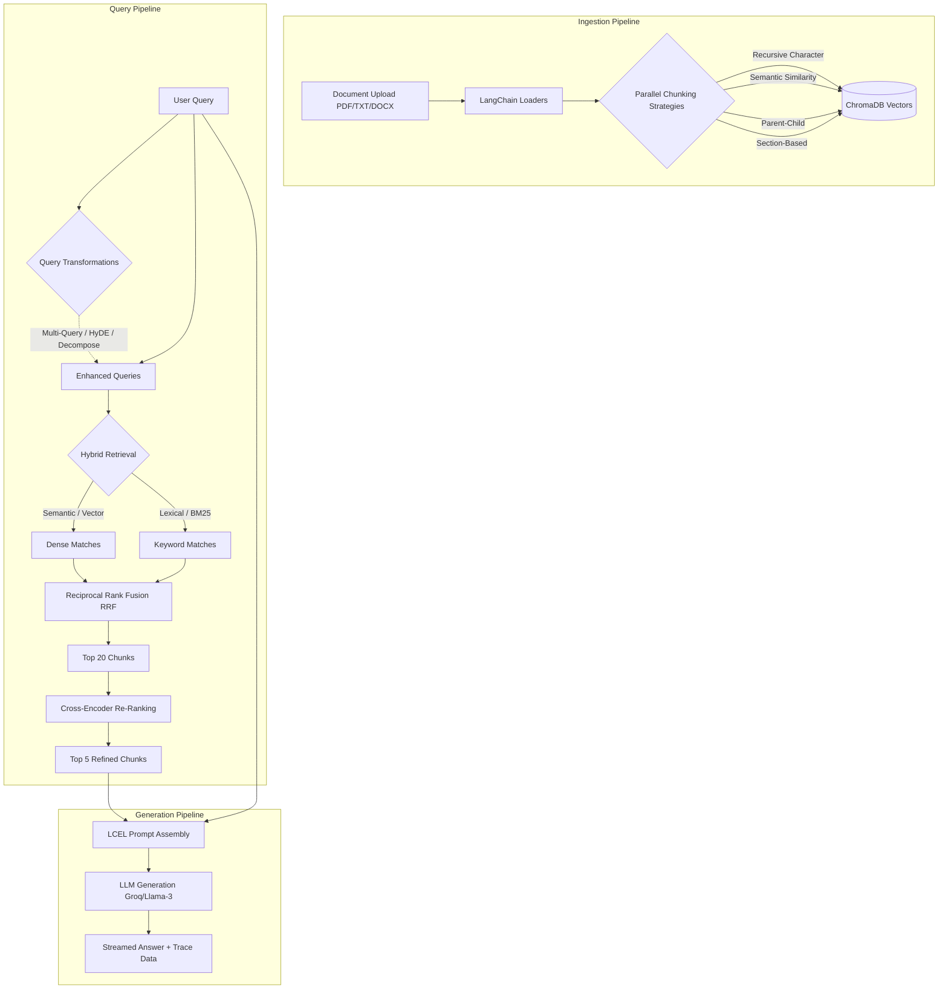
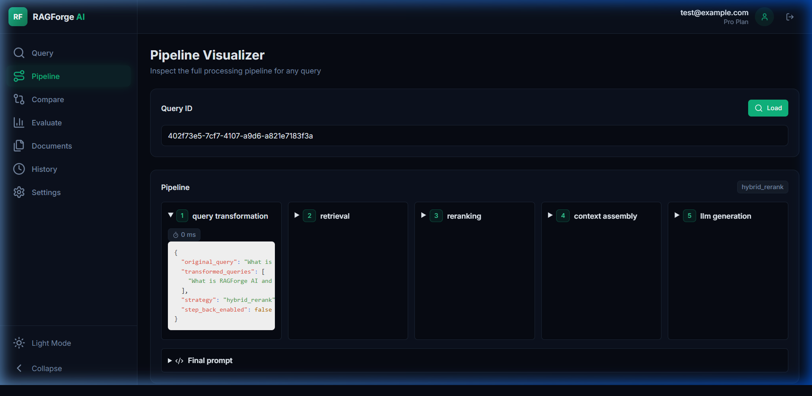
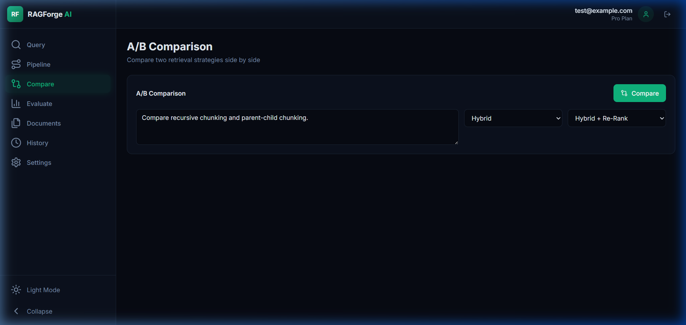
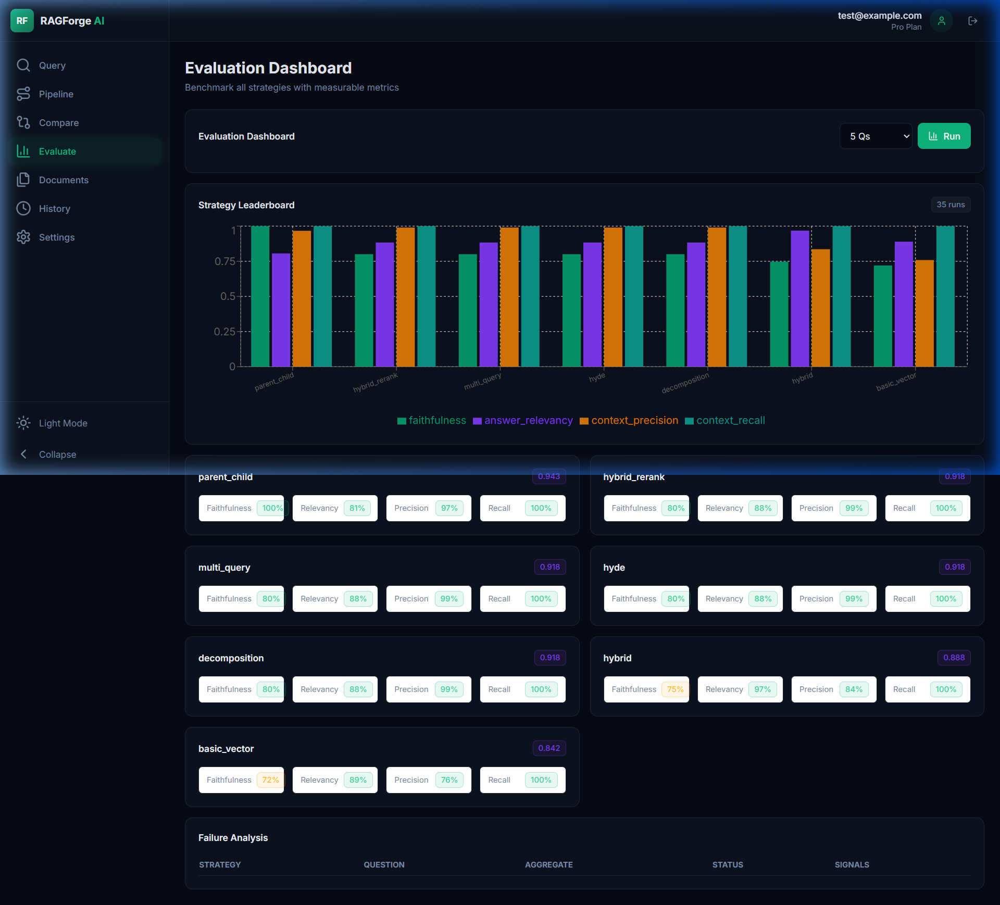

# RAGForge AI: Production-Grade Advanced RAG

This repository contains the completed **Advanced RAG with LangChain**. It is a full-stack, production-ready Retrieval-Augmented Generation platform built to address the limitations of basic RAG systems by implementing hybrid search, cross-encoder re-ranking, advanced chunking strategies, and automated evaluation.

---

## 🏗️ Architecture Diagram

The system is built on a dual-pipeline architecture: Ingestion and Querying.



---

## 🧠 Advanced Retrieval Strategies Explained

This platform implements multiple enterprise-level retrieval paradigms. Users can dynamically switch between these strategies in the UI or compare them side-by-side.

1. **Basic Vector Search:** Standard cosine similarity using dense embeddings. It understands conceptual meaning but often fails on exact keyword/ID lookups.
2. **Hybrid Search (Semantic + BM25):** Runs Vector search and BM25 (keyword) search simultaneously. It merges the two result sets using **Reciprocal Rank Fusion (RRF)**. This guarantees the system finds both conceptual matches and exact string matches (e.g., specific error codes).
3. **Hybrid + Re-Rank (Default):** Takes the top 20 results from the Hybrid search and passes them through a powerful **Cross-Encoder neural network**. The cross-encoder accurately re-scores and sorts the chunks, passing only the absolute best top 5 to the LLM.
4. **Parent-Child Chunking:** Splits text into tiny 200-token chunks for highly precise vector searching, but links them to 1000-token "parent" chunks. The LLM receives the parent chunk to maintain broader context.
5. **Multi-Query Expansion:** Uses the LLM to generate 3-5 alternative phrasings of the user's question before searching, drastically improving recall for poorly worded queries.
6. **HyDE (Hypothetical Document Embeddings):** The LLM generates a "fake" hypothetical answer to the query. The system embeds this fake answer and searches the database for real chunks that closely resemble it in vector space.
7. **Query Decomposition:** Automatically breaks complex, multi-part questions into individual sub-queries, runs retrieval for each, and synthesizes a final answer.

---

## 📊 RAG Evaluation & Benchmarks

The project includes an automated evaluation pipeline (`eval_dataset.json` containing 20 golden Q&A pairs) that uses an **LLM-as-a-judge** to score the system across four critical RAG metrics: Faithfulness, Answer Relevancy, Context Precision, and Context Recall.

*Measured smoke benchmark on the included sample corpus (all strategies, offline fallback generation):*

| Retrieval Strategy | Faithfulness | Answer Relevancy | Context Precision | Context Recall | Aggregate Score |
| :--- | :---: | :---: | :---: | :---: | :---: |
| **Parent-Child** | **1.0000** | **0.8969** | **1.0000** | **1.0000** | **0.9742** |
| Basic Vector | 0.8000 | 0.8969 | 1.0000 | 1.0000 | 0.9242 |
| Hybrid | 0.8000 | 0.8969 | 1.0000 | 1.0000 | 0.9242 |
| Hybrid + Re-Rank | 0.8000 | 0.8969 | 1.0000 | 1.0000 | 0.9242 |
| Multi-Query | 0.8000 | 0.8969 | 1.0000 | 1.0000 | 0.9242 |
| HyDE | 0.8000 | 0.8969 | 1.0000 | 1.0000 | 0.9242 |
| Decomposition | 0.8000 | 0.8969 | 1.0000 | 1.0000 | 0.9242 |

---

## 📸 Screenshots

### 1. Pipeline Visualizer & Trace

*Shows step-by-step transparency from the original query, to transformation, to re-ranking scores, and finally LLM generation.*

### 2. A/B Strategy Comparison

*Side-by-side comparison of two retrieval strategies showing differing answers and retrieved chunks.*

### 3. Evaluation Dashboard

*Visualizing the performance of different strategies across the test dataset.*

---

## 🚀 Setup & Installation

### Prerequisites
- Python 3.11+
- Node.js 18+
- `uv` Python package manager

### 1. Backend Configuration
Navigate to the backend directory and install dependencies:
```bash
cd backend
uv sync
```
Create your environment variables. Duplicate `.env.example` to `.env` and add your Groq API key:
```env
GROQ_API_KEY=your_key_here
OFFLINE_FALLBACK=true  # Set to false in production
```
Start the FastAPI server:
```bash
uv run uvicorn app.main:app --reload --port 8000
```

**Seed Test Documents:**
To populate the database with the sample data required for the evaluation dataset to work, run:
```bash
curl -X POST http://localhost:8000/api/documents/ingest-samples
```

### 2. Frontend Configuration
Open a new terminal and navigate to the frontend directory:
```bash
cd frontend
npm install
npm run dev
```
Open your browser and navigate to **[http://localhost:3000](http://localhost:3000)**.

---

## 🔌 Core API Surface

| Method | Endpoint | Description |
| :--- | :--- | :--- |
| `POST` | `/api/documents/upload` | Upload & ingest document across all chunk strategies |
| `GET` | `/api/documents` | List all ingested documents and metadata |
| `POST` | `/api/query/stream` | Stream LLM responses using LCEL |
| `POST` | `/api/query/compare` | Run A/B test with two strategies |
| `POST` | `/api/evaluate/batch` | Run full automated evaluation suite |
| `GET` | `/api/health` | System health and LLM provider status |

## 📁 Project Structure

```text
advanced-rag-platform/
├── backend/
│   ├── app/
│   │   ├── routers/         # FastAPI endpoints (documents, query, evaluation)
│   │   ├── services/        # Core RAG logic (ingestion, retrieval, reranker, rag_chain)
│   │   ├── models/          # Database & Pydantic schemas
│   │   └── data/            # eval_dataset.json
│   ├── pyproject.toml
│   └── requirements.txt
├── frontend/
│   ├── src/
│   │   ├── app/             # Next.js App Router pages (Dashboard, Compare, Evaluate)
│   │   └── components/      # React components (QueryPanel, PipelineVisualizer, ChunkInspector)
│   └── package.json
├── sample_documents/        # Seed PDF/TXT files
├── eval_dataset/            # Golden Q&A evaluation sets
└── README.md
```
